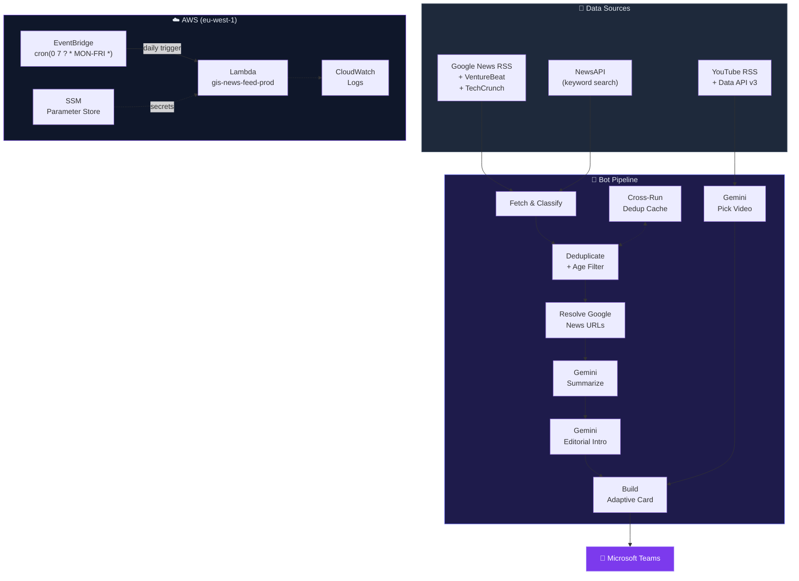

# ⚛️ Gallarus Intelligence Bulletin

**Automated AI news digest delivered to Microsoft Teams every morning.**

Fetches news from RSS + NewsAPI, summarizes with Google Gemini, curates a YouTube learning video, and posts a branded Adaptive Card to your Teams channel — all on autopilot via AWS Lambda.

---

## Architecture



## Pipeline Flow

```mermaid
sequenceDiagram
    participant EB as EventBridge
    participant λ as Lambda
    participant RSS as RSS Feeds
    participant API as NewsAPI
    participant Cache as Dedup Cache
    participant Gemini as Gemini AI
    participant YT as YouTube
    participant Teams as Teams

    EB->>λ: cron trigger (07:00 UTC)

    rect rgb(30, 27, 75)
        Note over λ,API: 1. Fetch
        λ->>RSS: 8 RSS feeds
        RSS-->>λ: ~600 entries
        λ->>API: 4 keyword queries
        API-->>λ: ~20 articles
    end

    rect rgb(30, 27, 75)
        Note over λ,Cache: 2. Filter
        λ->>λ: Deduplicate + age filter → ~58
        λ->>Cache: Check seen hashes
        Cache-->>λ: Unseen set
        λ->>λ: Truncate to 10
        λ->>λ: Resolve Google News URLs
    end

    rect rgb(49, 46, 129)
        Note over λ,Gemini: 3. AI Processing
        λ->>Gemini: Summarize 10 articles
        Gemini-->>λ: Summaries + takeaways
        λ->>Gemini: Generate editorial intro
        Gemini-->>λ: Intro paragraph
    end

    rect rgb(49, 46, 129)
        Note over λ,YT: 4. Video Curation
        λ->>YT: RSS + API search
        YT-->>λ: ~24 candidates
        λ->>Gemini: Pick best video
        Gemini-->>λ: Featured video
    end

    rect rgb(124, 58, 237)
        Note over λ,Teams: 5. Deliver
        λ->>λ: Build Adaptive Card (<28KB)
        λ->>Teams: POST webhook
        Teams-->>λ: 200 OK
        λ->>Cache: Mark articles seen
    end
```



## Project Structure

```
gis_news_feed/
├── bot/                        # Core package
│   ├── config.py               # All settings + API keys (.env)
│   ├── cache.py                # Cross-run dedup (72h TTL)
│   ├── fetchers/
│   │   ├── news.py             # RSS + NewsAPI + Google News URL resolver
│   │   └── youtube.py          # Channel RSS + Data API v3
│   ├── ai/
│   │   └── summarizer.py       # Gemini: summarize, intro, video pick
│   └── delivery/
│       └── teams.py            # Adaptive Card builder + webhook
├── infra/                      # Terraform (eu-west-1)
│   ├── main.tf                 # Lambda, EventBridge, IAM, SSM, CloudWatch
│   ├── variables.tf            # Inputs (secrets marked sensitive)
│   ├── outputs.tf              # Function ARN, log group, schedule
│   └── versions.tf             # Provider + backend config
├── scripts/
│   └── build_lambda.sh         # Docker-based Lambda zip build
├── main.py                     # CLI entry point (local / cron)
├── lambda_handler.py           # AWS Lambda entry point
├── requirements.txt            # Python dependencies
└── .env                        # Secrets (git-ignored)
```

## Quick Start (Local)

```bash
# 1. Clone and setup
cd gis_news_feed
python -m venv .venv && source .venv/bin/activate
pip install -r requirements.txt

# 2. Configure secrets
cp .env.example .env
# Edit .env with your API keys

# 3. Run
python main.py --dry-run    # Preview without posting
python main.py              # Post to Teams
python main.py --daemon     # Run continuously (7 AM UTC daily)
```

## AWS Deployment

```bash
# 1. Build Lambda package (requires Docker)
./scripts/build_lambda.sh

# 2. Deploy infrastructure
cd infra
source ../.env
terraform init
terraform apply \
  -var="gemini_api_key=${GEMINI_API_KEY}" \
  -var="teams_webhook_url=${TEAMS_WEBHOOK_URL}" \
  -var="news_api_key=${NEWS_API_KEY}" \
  -var="youtube_api_key=${YOUTUBE_API_KEY}"

# 3. Test
aws lambda invoke \
  --function-name gis-news-feed-prod \
  --region eu-west-1 \
  --payload '{"source":"test"}' \
  --cli-binary-format raw-in-base64-out \
  /tmp/response.json && cat /tmp/response.json
```

## Configuration

| Variable | Required | Description |
|----------|----------|-------------|
| `GEMINI_API_KEY` | Yes | Google AI Studio key |
| `TEAMS_WEBHOOK_URL` | Yes | Teams Incoming Webhook URL |
| `NEWS_API_KEY` | No | NewsAPI.org key (enriches feed) |
| `YOUTUBE_API_KEY` | No | YouTube Data API v3 key (more video sources) |

| Setting | Default | Location |
|---------|---------|----------|
| `GEMINI_MODEL` | `gemini-3-flash-preview` | `bot/config.py` |
| `MAX_ARTICLES` | `10` | `bot/config.py` |
| `MAX_ARTICLE_AGE_HOURS` | `28` | `bot/config.py` |
| `MAX_VIDEOS` | `10` | `bot/config.py` |
| Schedule | Weekdays 07:00 UTC | `infra/variables.tf` |

## Teams Card Categories

| Category | Keywords Matched |
|----------|-----------------|
| 🧠 Models & Research | LLMs, GPT, Gemini, Claude, training, benchmarks, transformers |
| 🛠️ Tools & Products | AI tools, chatbots, copilots, agents, APIs, platforms, releases |
| 📈 Industry & Business | Funding, acquisitions, regulation, enterprise adoption |
| 🔮 AI Frontier | General AI news not matching above |

## Costs

| Service | Free Tier | Estimated Monthly |
|---------|-----------|-------------------|
| Gemini API | 15 RPM free | $0 (well within limits) |
| NewsAPI | 100 req/day | $0 (free plan) |
| YouTube Data API | 10,000 units/day | $0 (free quota) |
| AWS Lambda | 1M invocations/month | $0 (free tier) |
| EventBridge Scheduler | 14M invocations/month | $0 (free tier) |
